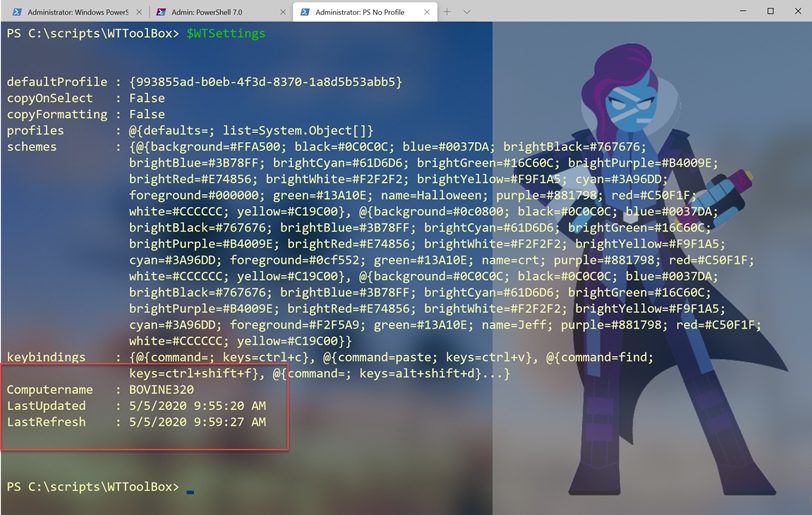

# WTToolBox

[](https://www.powershellgallery.com/packages/WTToolBox/) [](https://www.powershellgallery.com/packages/WTToolBox/)


A set of PowerShell functions for managing and working with the [Windows Terminal](https://www.microsoft.com/store/productId/9N0DX20HK701) application from Microsoft. You can download the module from the PowerShell Gallery. It should work on Windows platforms under Windows PowerShell and PowerShell 7.

```powershell
Install-Module WTToolBox
```
Of course, it is assumed you have Windows Terminal installed or planned to. If Windows Terminal is not installed, you will get an warning message when you import this module.

## Module Commands

* [Backup-WTSetting](docs/Backup-WTSetting.md)
* [Get-WTKeyBinding](docs/Get-WTKeyBinding.md)
* [Get-WTProcess](docs/Get-WTProcess.md)
* [Open-WTDefault](docs/Open-WTDefault.md)
* [Test-WTVersion](docs/Test-WTVersion.md)

## Tracking Windows Terminal Version

Because Windows Terminal can silently update, it may be difficult to know if you are running a new version. You might use the `Test-WTVersion` command in your PowerShell profile script like this:

```powershell
if ( $env:wt_session -AND Test-WTVersion) {
    Write-Host "A newer version of Windows Terminal is now installed." -foreground Yellow
    Start-Process https://github.com/microsoft/terminal/releases
}
```

## Global Variables

To make it easier to see either default settings or your custom settings, when you import this module, it will define 3 global variables. Assuming of course that you have Windows Terminal installed and are using `settings.json`.

### WTSettingsPath

The path to `settings.json` is buried in your AppData folder. You can use `$WTSettingsPath` as a placeholder. Yes, you can easily open the file from Windows Terminal but there may be other things you want to do with the path information.

### WTDefaults

You can use `$WTDefaults` as an object to view any number of default settings. Use `Open-WTDefaults` if you want to open the file in your code editor.

```powershell
PS C:>\ $WTDefaults | Select-Object -property initial*

initialCols initialRows
----------- -----------
        120          30
```

### WTSettings

The last object is a customized version of the data in `settings.json`. This should make it easier to see your settings.

```powershell
PS C:\> $wtsettings.profiles.list | where-object hidden

guid       : {b453ae62-4e3d-5e58-b989-0a998ec441b8}
hidden     : True
useAcrylic : False
name       : Azure Cloud Shell
source     : Windows.Terminal.Azure

guid   : {574e775e-4f2a-5b96-ac1e-a2962a402336}
hidden : True
name   : PowerShell
source : Windows.Terminal.PowershellCore

guid   : {6e9fa4d2-a4aa-562d-b1fa-0789dc1f83d7}
hidden : True
name   : Legacy
source : Windows.Terminal.Wsl

guid   : {c6eaf9f4-32a7-5fdc-b5cf-066e8a4b1e40}
hidden : True
name   : Ubuntu-18.04
source : Windows.Terminal.Wsl
```

The object includes a few additional properties.



The `LastUpdated` value is when `settings.json` was last revised. The `LastRefresh` value indicates when this object was created. Because you might modify your settings, after importing this module, there needed to be a mechanism to refresh the data. The custom object has a `Refresh()` method you can run at any time.

```powershell
PS C:\> $WTSettings.refresh()
```

The method doesn't write anything to the pipeline.

## Future Versions

If you have any suggestions for enhancements or bug reports, please use the Issues section.

Last updated 2020-05-05 14:27:45Z UTC
