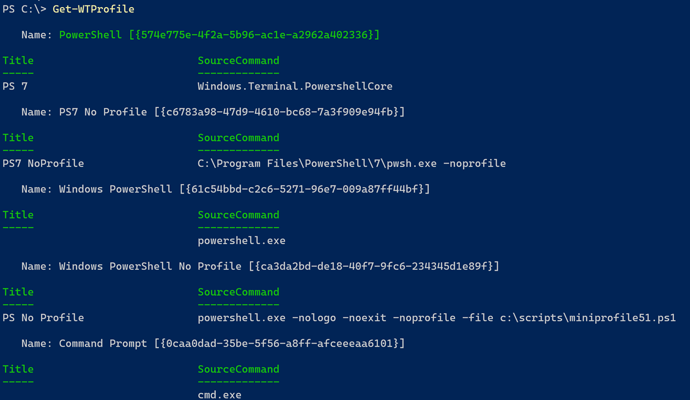
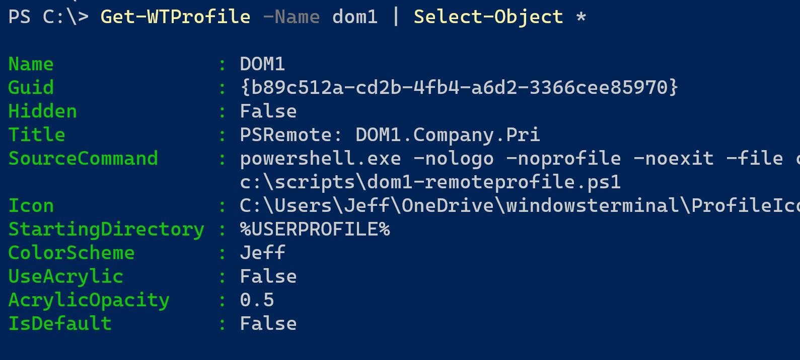
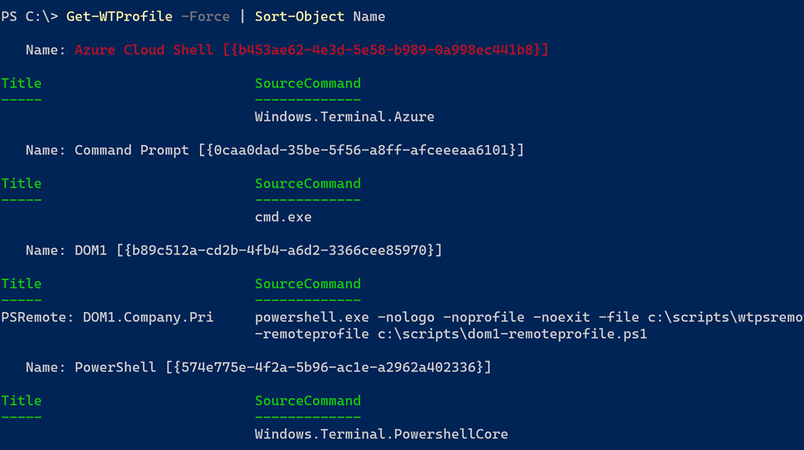
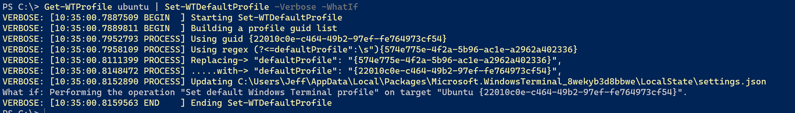
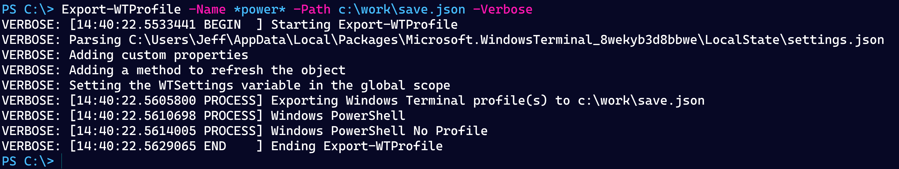
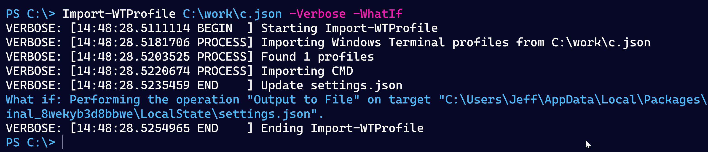
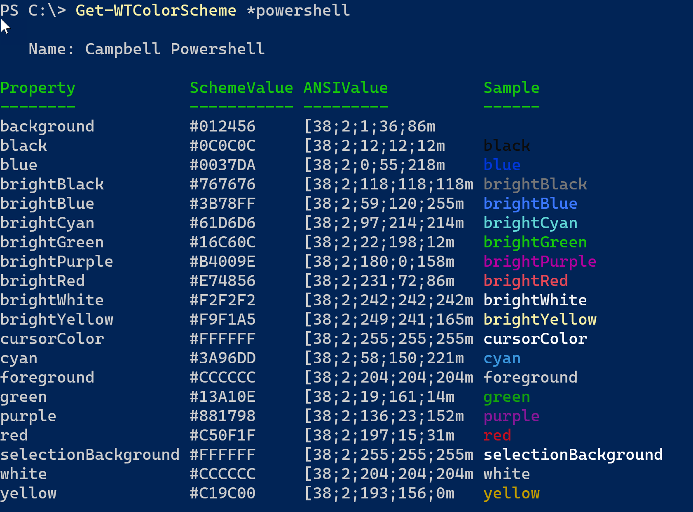
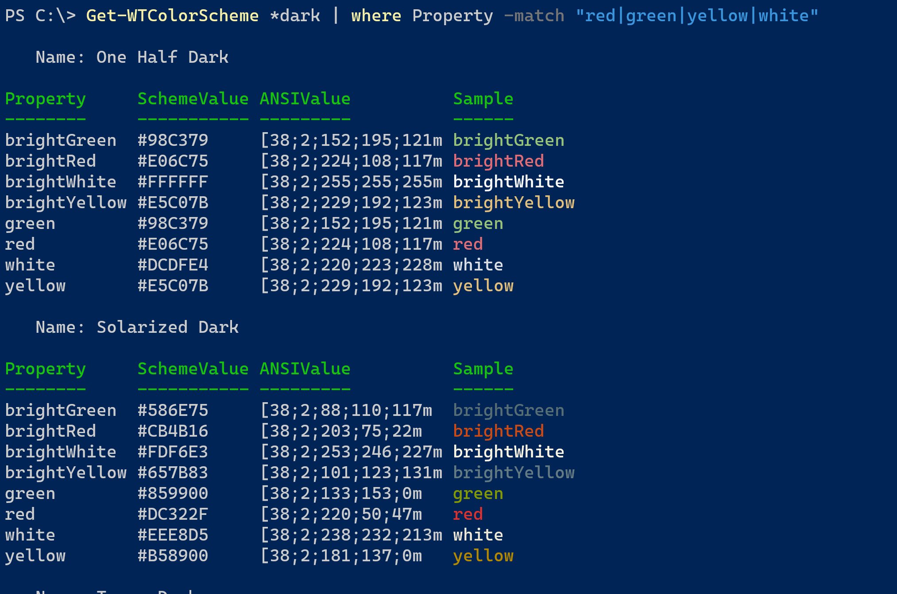

# WTToolBox

[](https://www.powershellgallery.com/packages/WTToolBox/) [](https://www.powershellgallery.com/packages/WTToolBox/)


## Windows Terminal Toolbox

A set of PowerShell functions for managing and working with the [Windows Terminal](https://www.microsoft.com/store/productId/9N0DX20HK701) application from Microsoft. You can download the module from the PowerShell Gallery. This module should work on __Windows__ platforms under Windows PowerShell and PowerShell 7.

```powershell
Install-Module WTToolBox [-scope CurrentUser]
```

Of course, it is assumed you have `Windows Terminal` installed, or you plan to install. If `Windows Terminal` is not installed, you will get a warning message when you import this module.

If you want some background information on Windows Terminal, take a look at [https://devblogs.microsoft.com/commandline/getting-started-with-windows-terminal/](https://devblogs.microsoft.com/commandline/getting-started-with-windows-terminal/).

### __Important__

Windows Terminal is intended for use on a Windows 10 or Windows 11 desktop. In fact, it is now the default on Windows 11. You __cannot__ install Windows Terminal on Windows Server 2016 or 2019. Those platform do not meet the Windows Terminal minimal requirements. Based on [issues](https://github.com/microsoft/terminal/issues?q=is%3Aissue+windows+server+2022) in the Windows Terminal Github repository, Windows Terminal should install on Windows Server 2022 but there still appear to be compatibility issue.

## Module Commands

* [Backup-WTSetting](docs/Backup-WTSetting.md)
* [Export-WTProfile](docs/Export-WTProfile.md)
* [Get-WTColorScheme](docs/Get-WTColorScheme.md)
* [Get-WTCurrent](docs/Get-WTCurrent.md)
* [Get-WTCurrentRelease](docs/Get-WTCurrentRelease.md)
* [Get-WTKeyBinding](docs/Get-WTKeyBinding.md)
* [Get-WTProcess](docs/Get-WTProcess.md)
* [Get-WTProfile](docs/Get-WTProfile.md)
* [Get-WTReleaseNote](docs/Get-WTReleaseNote.md)
* [Import-WTProfile](docs/Import-WTProfile.md)
* [Install-WTRelease](docs/Install-WTRelease.md)
* [New-WTProfile](docs/New-WTProfile.md)
* [Open-WTDefault](docs/Open-WTDefault.md)
* [Set-WTDefaultProfile](docs/Set-WTDefaultProfile.md)
* [Test-IsWTPreview](docs/Test-IsWTPreview.md)
* [Test-WTVersion](docs/Test-WTVersion.md)

### Installing Windows Terminal

You can install the latest stable or preview release of Windows Terminal using the packages available on GitHub.

```powershell
Install-WTRelease [-preview]
```

The `Install-WTRelease` function has an alias of `Install-WindowsTerminal`.

:warning: You can't install a version from within Windows Terminal because files will be in use. Close Windows Terminal and run `Install-WTRelease` in a traditional PowerShell window.

### Displaying Key Bindings

Keeping track of all the possible keyboard shortcuts or keybindings can be difficult. `Get-WTKeyBinding` will go through all defined keybindings and display them.

```powershell
PS C:\> Get-WTKeyBinding

   Source: Defaults

Action               ActionSettings                           Keys
------               --------------                           ----
closeWindow                                                   alt+f4
toggleFullscreen                                              alt+enter
toggleFullscreen                                              f11
toggleFocusMode
toggleAlwaysOnTop
openNewTabDropdown                                            ctrl+shift+space
openSettings                                                  ctrl+,
openSettings         target = defaultsFile                    ctrl+alt+,
find                                                          ctrl+shift+f
toggleRetroEffect
...

Source: Settings

Action               ActionSettings                           Keys
------               --------------                           ----
copy                 singleLine = False                       ctrl+c
paste                                                         ctrl+v
find                                                          ctrl+shift+f
splitPane            split = auto;splitMode = duplicate       alt+shift+d
newTab               profile = Ubuntu                         ctrl+shift+u
splitPane            split = auto;profile = PS7 No            ctrl+shift+>
                     Profile;startingDirectory =
                     C:\;tabTitle = PS7 Clean
splitPane            split = auto;profile = Windows           ctrl+shift+<
                     PowerShell No Profile;startingDirectory
                     = C:\;tabTitle = PS Clean
openTabColorPicker                                            ctrl+/
```

You can also select a specific action:

```poweshell
PS C:\> Get-WTKeyBinding -Action *font* | Format-List

Source: Defaults


Action         : adjustFontSize
ActionSettings : delta = 1
Keys           : ctrl+=

Action         : adjustFontSize
ActionSettings : delta = -1
Keys           : ctrl+-

Action         : resetFontSize
ActionSettings :
Keys           : ctrl+0
```

### Getting Current Settings

Use `Get-WTCurrent` to display the settings for the current PowerShell session in Windows Terminal.


### Tracking Windows Terminal Releases

Because `Windows Terminal` can silently update, it may be awkward to know if you are running a new version. You might use the `Test-WTVersion` command in your PowerShell profile script like this:

```powershell
if ( $env:wt_session -AND (Test-WTVersion)) {
    Write-Host "A newer version of Windows Terminal is now installed." -foreground Yellow
    Start-Process https://github.com/microsoft/terminal/releases
}
```

On a related note, you can also use `Get-WTReleaseNote,` which will get the latest release information from the `Windows Terminal` GitHub repository. If you are running PowerShell 7.x, you can pipe the command to `Show-Markdown`.

```powershell
Get-WTReleaseNote | Show-Markdown -UseBrowser
```

The document will have links to any referenced issues.

You can also use [Get-WTCurrentRelease](docs/Get-WTCurrentRelease.md) to get a quick peek at the latest online version and your locally installed version.

```powershell
PS C:\> Get-WTCurrentRelease

Name                        Version       Released             LocalVersion
----                        -------       --------             ------------
Windows Terminal v1.13.1143 v1.13.11431.0 5/24/2022 5:01:48 PM 1.13.11432.0
```

### Windows Terminal Processes

The `Get-WTProcess` command will get all processes associated with your Windows Terminal process. The output is a standard `System.Diagnostics.Process` object, but the default formatting has been customized to highlight the current PowerShell process.


`Get-WTProcess` has an alias of `gwtp`.

## Global Variables

To make it easier to see either default settings or your custom settings, when you import this module, it will define 3 global variables. Assuming, of course, that you have `Windows Terminal` installed and are using `settings.json`.

### WTSettingsPath

The path to `settings.json` is buried in your `%AppData%` folder. You can use `$WTSettingsPath` as a placeholder. Yes, you can easily open the file from `Windows Terminal`, but there may be other things you want to do with the path information.

### WTDefaults

You can use `$WTDefaults` as an object to view any number of default settings. Use `Open-WTDefaults` if you want to open the file in your code editor.

```powershell
PS C:>\ $WTDefaults | Select-Object -property initial*

initialCols initialRows
----------- -----------
        120          30
```

When you import the module, it will also create a variable called `$WTDefaultsPath,` which points to the `defaults.json` file. The variable makes it easier if you want to do something with it like make a copy. If you need to view the file, you can use the [Open-WTDefault](docs/Open-WTDefault.md) command.

> If you have a preview release also installed, this variable will have two objects.

### WTSettings

The last object is a customized version of the data in `settings.json`. `$WTSettings` should make it easier to see your settings.

```powershell
PS C:\> $wtsettings.profiles.list | Where-Object hidden

guid       : {b453ae62-4e3d-5e58-bget989-0a998ec441b8}
hidden     : True
useAcrylic : False
name       : Azure Cloud Shell
source     : Windows.Terminal.Azure

guid   : {574e775e-4f2a-5b96-ac1e-a2962a402336}
hidden : True
name   : PowerShell
source : Windows.Terminal.PowershellCore

guid   : {6e9fa4d2-a4aa-562d-b1fa-0789dc1f83d7}
hidden : True
name   : Legacy
source : Windows.Terminal.Wsl

guid   : {c6eaf9f4-32a7-5fdc-b5cf-066e8a4b1e40}
hidden : True
name   : Ubuntu-18.04
source : Windows.Terminal.Wsl
```

The object includes a few additional properties.


The `LastUpdated` value is when `settings.json` was last revised. The `LastRefresh` value indicates when this object was created. Because you might modify your settings, after importing this module, there needed to be a mechanism to refresh the data. The custom object has a `Refresh()` method you can run at any time.

```powershell
PS C:\> $WTSettings.refresh()
```

The method doesn't write anything to the pipeline.

_A quick note on the `settings` and `default` objects. The JSON standard does not recognize comments, yet they are used in `Windows Terminal` settings files. You can see them with leading // characters. To avoid errors when converting the JSON to objects, these comments must be stripped out of the content. The clean-up process is done with a regular expression. PowerShell 7 is more forgiving if it detects comments. Windows PowerShell will refuse to convert the content from JSON. Although the module can handle JSON comments, the recommendation is that if you are using comments, that you insert a space after the leading slashes like this:  `// this is a comment`._

## Windows Terminal Profiles

Beginning with version 1.14.0 of this module, you can use PowerShell functions to manage Windows Terminal profiles instead of relying on the module variables like `$wtsettings`.

### Getting Windows Terminal Profiles

You can use [Get-WTProfile](docs/Get-WTProfile.md) to return all defined Windows Terminal Profiles. The default behavior is to get all non-hidden profiles. The default profile will be highlighted in green.



The command displays formatted results. But there are other properties you can view.



If you opt to view hidden profiles as well, those will be highlighted in red or at least whatever is close to red depending on your color scheme.



### Set Default Profile

Use [Set-WTDefaultProfile](docs/Set-WTDefaultProfile.md) to assign a profile from the PowerShell prompt. The easiest approach is to use `Get-WTProfile` to select a single profile and pipe that to the function.



### Creating a New Profile

You can use [New-WTProfile](docs/New-WTProfile.md) to create a new profile. The command parameters will set the most commonly used profile settings. You can manually adjust the profile after it has been created.

```powershell
New-WTProfile -Name CMD -CommandLine cmd.exe -TabTitle Windows -CursorShape vintage -StartingDirectory "%WINDIR%"
```

Note that some values are case-sensitive. Use tab-completion wherever it is enabled for command parameters. The new profile will be inserted at the beginning of the profile list. You will need to manually edit the settings file to re-order profiles.

### Exporting Profiles

For backup or testing purposes, you may want to export your custom Windows Terminal profiles with [Export-WTProfile](docs/Export-WTProfile.md). The default is to export all profiles with a commandline property. This command will not export built-in profiles like Azure Cloud Shell. You can also specify profiles to export. Wildcards are permitted.



The export path must be a Json file.

### Importing Profiles

Once you have an export file, you can use [Import-WTProfile](docs/Import-WTProfile.md) into your current settings. The profile name must not already exist. It is assumed the guids you are importing will be unique. Unlike using `New-WTProfile` the import process will set all profile settings that you exported.



Profiles with duplicate names will be skipped.

## Windows Terminal Color Schemes

`Get-WTColorScheme` is designed to show you the defined color schemes. You can select color schemes by name, including the use of wildcards, or use tab-completion. If you omit a name, the default is to get all color schemes.



The output will include a sample property formatted using the ANSI equivalent. This allows you to preview a scheme in your terminal session. Some schemes might have different definitions for a color like `red`.



## Known Issues

The Pester tests for this module will most likely fail when run under Pester 5.x. They are designed for Pester version 4.10.1 and need to be revised to meet the latest Pester test format.

## Future Versions

If you have any suggestions for enhancements or bug reports, please use the [Issues](https://github.com/jdhitsolutions/WTToolbox/issues) section of this repository.
